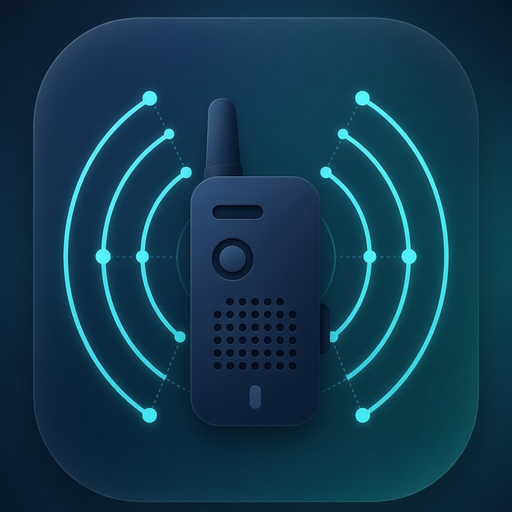

# Connect

Hold the button, or just speak. No accounts.

Connect is an Android walkie-talkie for people already on this Tailscale network (`tail51f9d6.ts.net`). Opening the app joins Everyone. You can create another room, and friends on this network see it and can join it. The relay runs on this PC and is published with `tailscale serve`, so it is not on the public internet. A phone still needs the Tailscale app connected, or it cannot reach the room.

The repo is public so a link works for friends. The release APK is the download. Being on the tailnet is the access check.



## Use it

1. Install [Tailscale](https://tailscale.com/download) and join this tailnet. The owner invites the phone.
2. Install the APK from the GitHub release.
3. Open Connect, type the name people should see, and join. You land in Everyone.
4. Tap Rooms to create a room or join one a friend created. One person talks at a time in each room.
5. The big number is how many people are in the room. Tap it to see who is there. Each person has a picture. Tap your picture, or Add a photo, to use one from your gallery. Until then, Connect draws a face from your id, and that drawn face is the same on every phone. A photo you pick shows up for everyone else in the room.
6. While someone talks, their picture grows and shrinks with their voice. Rings around it move like a speaker. A low voice pushes the picture out. A brighter voice pulls it in.
7. In the member list, each other person has a volume slider. Turning one friend down does not change anyone else, and it stays on this phone.
8. A short sound plays when someone else joins or leaves. The people already in the room when you arrive do not each play that sound.
9. Choose Hold or Voice. Hold means press the big button. Voice means just speak, and tap the button to mute.
10. Noise cancelling is on. It uses the phone's noise suppressor, echo canceler, and automatic gain. Turn it off for the plain microphone.
11. Before you play a game, turn on Volume keys and Bubble over games if Connect asks. Volume keys is in the phone's accessibility settings. The bubble is "display over other apps". Then minimize Connect. Holding a volume key, or holding Talk on the bubble, transmits. Letting go stops. A loud game does not open the microphone. The bubble shows who is talking. Opening Connect again uses the Hold or Voice choice you saved. Swiping Connect away leaves the room. This PC has to be awake.

Sound is 48 kHz mono, the same rate on every phone. Install 1.1.0 or newer on each phone. The 1.0.0 build used 16 kHz and will not sound right next to this one. Creating a room needs 1.2.0 or newer. A 1.1.0 phone stays in Everyone. The talking picture needs 1.4.0. Volume keys, the bubble, a shared photo, the join and leave sound, and per-person volume need 1.5.0. A 1.4.0 phone still talks at 48 kHz, shows the painted pictures, and listens for speech when you minimize it. It ignores the photo message.

The name stays on the phone. There is no login.

## Develop

```bash
python3 -m venv server/.venv
server/.venv/bin/pip install -r server/requirements.txt
server/.venv/bin/python server/test_relay.py
server/.venv/bin/python server/relay.py   # 127.0.0.1:8792

cd /home/shadowswords/Work/connect
flutter analyze
flutter test
flutter run --dart-define=CONNECT_URL=ws://10.0.2.2:8792/ws
flutter build apk --release
```

The release build reads `android/key.properties` (gitignored). On this machine the upload key is `~/.config/connect/upload-keystore.jks`. Without that file the release build is signed with the debug key.

The shipped app calls `wss://retroverse.tail51f9d6.ts.net:8732/ws`.

## Relay on this PC

`server/connect-relay.service` is the user systemd unit. It listens on `127.0.0.1:8792` only.

```bash
systemctl --user enable --now connect-relay.service
tailscale serve --bg --https=8732 http://127.0.0.1:8792
curl -fsS http://127.0.0.1:8792/health
```

Port 443 on this tailnet is already the arcade. Connect uses **8732**. Do not reset `tailscale serve`; that would drop the other ports.

Outfit is under the SIL Open Font License. See `assets/fonts/OFL.txt`.
